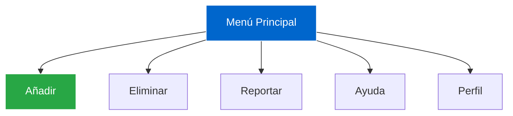

<div align="center">

# Kario Media Admin Panel  
**Panel Administrativo para Licitaciones Públicas y Privadas**


---

**JOHAN MONSALVE** • **DANIEL SANTOS**  


</div>

---

## Descripción del Proyecto

**Kario Media Admin Panel** es un **panel administrativo 100% estático** desarrollado **solo con HTML y CSS**, enfocado en:

- **Diseño limpio y profesional**  
- **Interfaz 100% responsiva** (móvil, tablet, escritorio)  
- **Animaciones suaves** (hover, focus, transiciones)  
- **Menú interactivo** con efectos visuales  
- **Módulos funcionales**: Añadir, Eliminar, Reportar, Ayuda, Perfil  

> **Sin JavaScript** – Todo logrado con **CSS puro** y **HTML semántico**.

---

## Características Destacadas

| Característica | Descripción |
|---------------|-----------|
| **Responsivo** | Se adapta a cualquier pantalla |
| **Animaciones CSS** | Transiciones, hover effects, fade-in |
| **Menú Interactivo** | Desplegable, con efectos visuales |
| **Tipografía y Espaciado** | Diseño limpio y legible |
| **Accesibilidad** | Etiquetas semánticas y contraste |




# 🛠️ Tecnologías Usadas

| Tecnología     | Uso                              |
|----------------|----------------------------------|
| **MongoDB**         | Base de datos NoSQL para almacenar productos de anime           |
| **JavaScript**      | Lógica del script: inserciones, actualizaciones, consultas y eliminaciones              |
| **Mongo Shell**     | Entorno de ejecución interactivo para comandos MongoDB          |

> *100% estático – sin dependencias externas*

## ⚙️ Instalación y Uso

Sigue estos pasos para ejecutar el proyecto localmente🧑‍💻👇:

```bash
# 1️⃣ Clonar el repositorio
git clone https://github.com/Johanbadillo/PROYECTO_MONSALVEJOHAN_SANTOSDANIEL.git

# 2️⃣ Entrar al directorio
cd PROYECTO_MONSALVEJOHAN_SANTOSDANIEL

# 3️⃣ Abrir en el navegador
open index.html
```

> *Demo en vivo: [Ver Panel](https://johanbadillo.github.io/PROYECTO_MONSALVEJOHAN_SANTOSDANIEL/)*
