<div align="center">

# Kario Media Admin Panel  
**Panel Administrativo para Licitaciones Públicas y Privadas**


---

**JOHAN MONSALVE** • **DANIEL SANTOS**  


</div>

---

## Descripción del Proyecto

**Kario Media Admin Panel** es un **panel administrativo 100% estático** desarrollado **solo con HTML y CSS**, enfocado en:

- **Diseño limpio y profesional**  
- **Interfaz 100% responsiva** (móvil, tablet, escritorio)  
- **Animaciones suaves** (hover, focus, transiciones)  
- **Menú interactivo** con efectos visuales  
- **Módulos funcionales**: Añadir, Eliminar, Reportar, Ayuda, Perfil  

> **Sin JavaScript** – Todo logrado con **CSS puro** y **HTML semántico**.

---

## Características Destacadas

| Característica | Descripción |
|---------------|-----------|
| **Responsivo** | Se adapta a cualquier pantalla |
| **Animaciones CSS** | Transiciones, hover effects, fade-in |
| **Menú Interactivo** | Desplegable, con efectos visuales |
| **Tipografía y Espaciado** | Diseño limpio y legible |
| **Accesibilidad** | Etiquetas semánticas y contraste |

```mermaid
graph TD
    A[Menú Principal] --> B[Añadir]
    A --> C[Eliminar]
    A --> D[Reportar]
    A --> E[Ayuda]
    A --> F[Perfil]
    style A fill:#0066CC,stroke:#fff,color:#fff
    style B fill:#28A745,stroke:#fff,color:#fff
```




# 🛠️ Tecnologías Usadas

| Tecnología     | Uso                              |
|----------------|----------------------------------|
| **HTML5**         | Estructura semántica y accesiblee           |
| **CSS3**      | Estilos, animaciones, transiciones, Flexbox/Grid            |
| **Figma**     | Diseño UI/UX de alta fidelidad         |

> *100% estático – sin dependencias externas*

## ⚙️ Instalación y Uso

Sigue estos pasos para ejecutar el proyecto localmente🧑‍💻👇:

```bash
# 1️⃣ Clonar el repositorio
git clone https://github.com/Johanbadillo/PROYECTO_MONSALVEJOHAN_SANTOSDANIEL.git

# 2️⃣ Entrar al directorio
cd PROYECTO_MONSALVEJOHAN_SANTOSDANIEL

# 3️⃣ Abrir en el navegador
open index.html
```

> *Demo en vivo: [Ver Panel](https://johanbadillo.github.io/PROYECTO_MONSALVEJOHAN_SANTOSDANIEL/)*

## 📁 Estructura del proyecto
```
📁 PROYECTO_MONSALVEJOHAN_SANTOSDANIE/
├── 📁 fonts/
├── 📁 img/
├── 📁 style/
│   ├── 📁 styleViews/
│   └── style.css
├── 📁 views/
├── index.html
├── inicio.html
├── LICENSE
└── README.md
```

## 📦 Entregables

| 📁 Entregable | 🔗 Enlace |
|------------|--------|
| **Código Fuente** |  [GitHub](https://github.com/Johanbadillo/PROYECTO_MONSALVEJOHAN_SANTOSDANIEL) |
| **Diseño UI/UX** |  [Ver figma](https://www.figma.com/design/UuZjHZ4iHRWyi73rXhp8IN/Untitled?node-id=0-1&p=f&t=PWKQJWaWzDBLVa4a-0) |
| **Documentación** | Este archivo |

---

## 👥 Autores

<div align="center">

| 🧑‍💻 Nombre | 🎯 Rol | 🔗 GitHub |
|--------|-----|--------|
| **Johan Monsalve** | ⚙️ HTML & CSS | [@Johanbadillo](https://github.com/Johanbadillo) |
| **Daniel Santos** | 📝 Diseño & Animaciones | [@DanielSantos](https://github.com/Daniel-Santos-F333) |

</div>

---

<div align="center">

**💖 Hecho con estilo, sin una línea de JavaScript 💖**  
**CampusLands • Cajasan • 2025**

</div>
